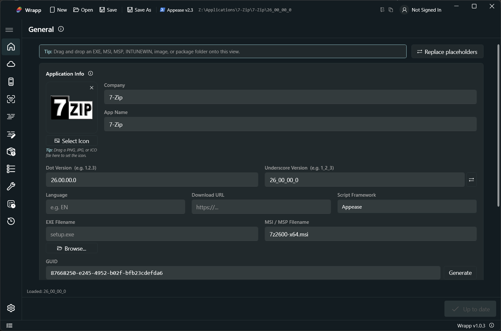
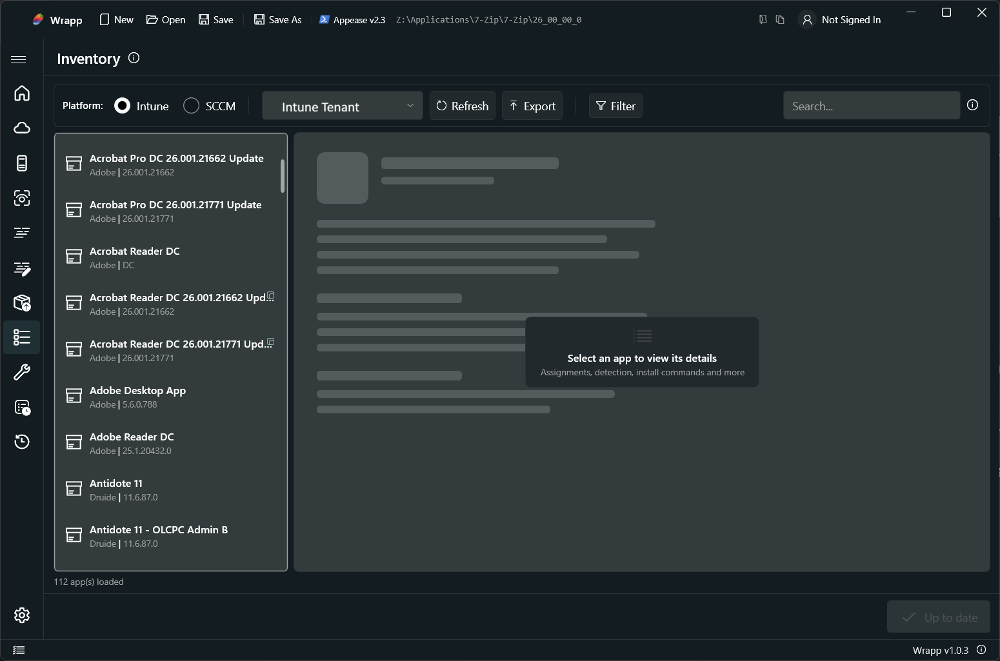
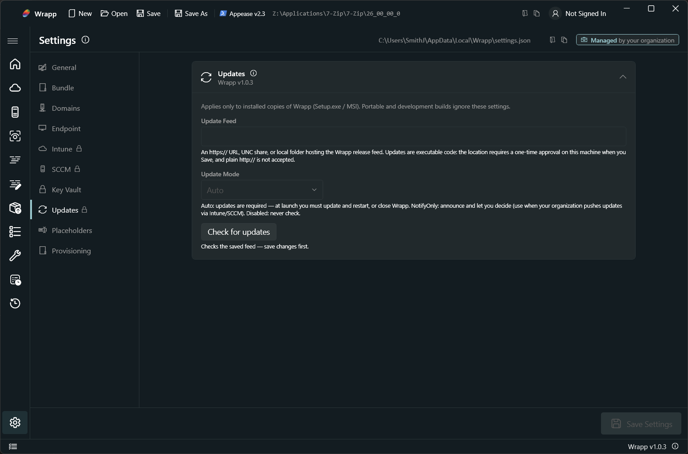
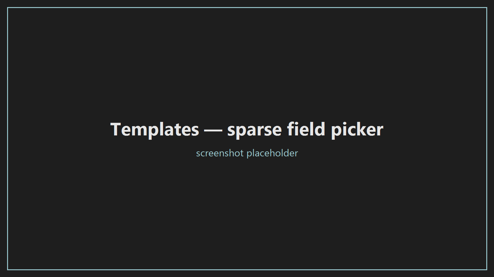
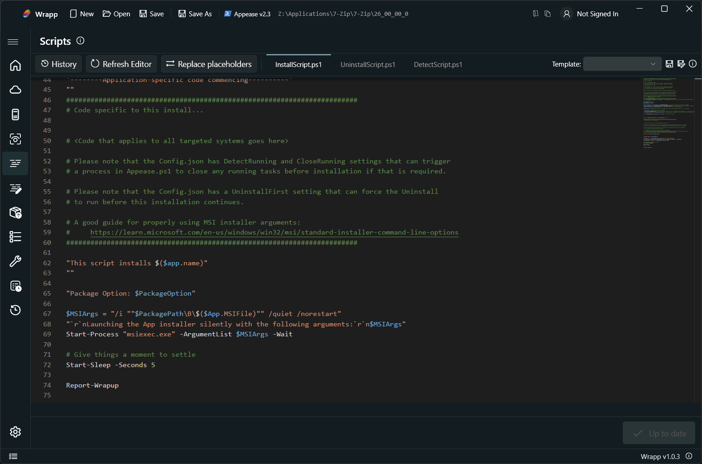
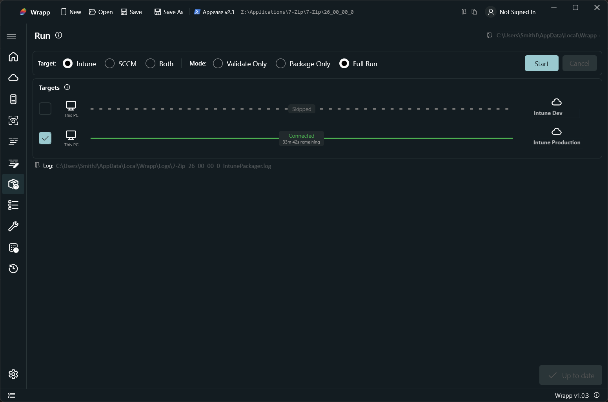
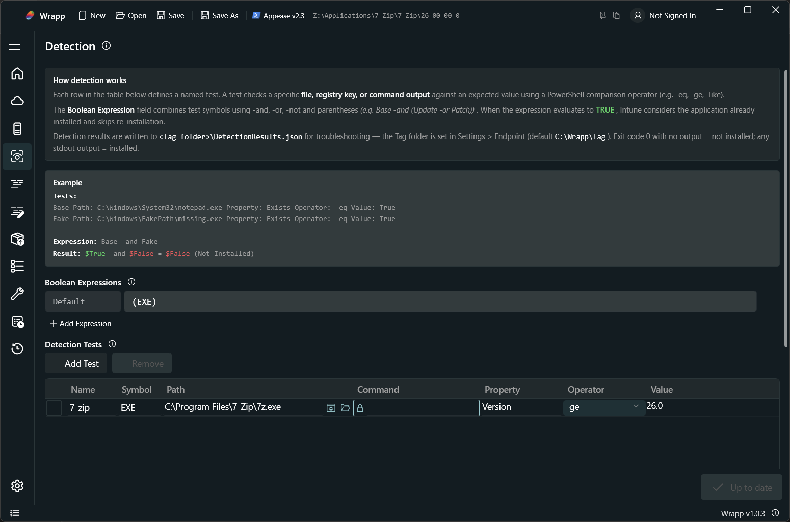
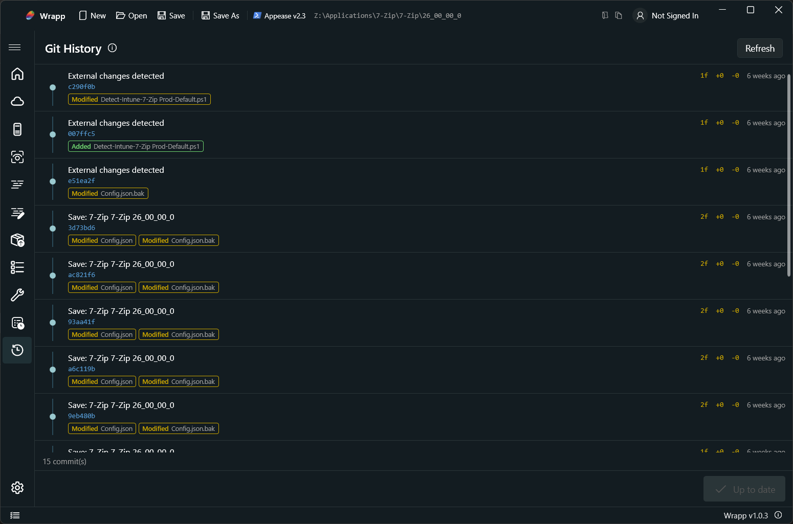

<p align="center">
  
</p>

<h1 align="center">Wrapp</h1>

<p align="center">
  <b>Package Win32 apps for Microsoft Intune and SCCM - from installer to deployed app, in one tool.</b>
</p>

<p align="center">
  
  
  
  
  
  
  
</p>

<p align="center">
  <!-- screenshot: main window, General view with a bundle open -->
  
</p>

---

## Why Wrapp

Packaging for Intune and ConfigMgr usually means juggling the Win32 Content Prep
Tool, hand-written install/uninstall/detection scripts, a dozen portal blades, and
no record of what changed. Wrapp folds that into one flow:

| | |
|---|---|
| **1. Bundle** | App metadata, scripts, detection, and icon live together in a folder, version-tracked by an embedded git repo - no git install required. |
| **2. Author** | Generate install/uninstall scripts from a template catalog (silent MSI, EXE, MSI+MSP, MSIX, winget, uninstall-then-install…) or write them in the built-in Monaco editor. Prefer PSADT? The v4 framework template is bundled and first-class. |
| **3. Validate** | Errors and warnings surface as badges from the navigation rail down to the field that caused them - including duplicate-name and duplicate-target detection across packages. |
| **4. Ship** | One click builds the `.intunewin`, uploads via Graph, creates the app with detection/requirements/dependencies/supersedence, and applies assignments - or creates the SCCM application, distributes content, and deploys it. |

Wrapp is two pieces working as one: **Wrapp.GUI**, the WPF operator surface, and
**Wrapp.Packager**, the first-party PowerShell module that does the actual Graph
and ConfigMgr work - and which runs headless for automation.

---

## Highlights

### Inventory - see your tenant like the console can't

<!-- screenshot: Inventory view with an app's detail pane and nested groups -->


Browse every deployed Win32 app with full detail panes, then go deeper than the
Intune UI:

- **Nested Entra ID group expansion** on assignments - the real membership tree.
- **Reverse relationships**: not just what an app depends on, but *what depends on it*.
- **Export**: per-app JSON, or the **entire tenant catalog** in one run (JSON + icons + `.intunewin` content, your choice).
- **Import back**: turn any deployed app into a new Wrapp bundle - metadata only, or a full clone.

### Enterprise-ready by policy

<!-- screenshot: Settings view showing managed (padlocked) fields -->


Every setting is administrator-controllable through plain registry policy
(`HKLM/HKCU\Software\Policies\Wrapp`) - delivered by Group Policy (ADMX/ADML in
[`policy/`](policy/)), Intune, or the offline
[`Apply-WrappPolicy.ps1`](scripts/Apply-WrappPolicy.ps1) for disconnected fleets.
Mandated settings lock their controls with a padlock and a *Managed by your
organization* indicator; tabs and whole views can be hidden outright. An
organization-defaults JSON seeds tenants, sites, domains, and placeholders on
first run. Custom themes import as safe, JSON-only `.wrapptheme.json` overlays.

### Templates and placeholders

<!-- screenshot: template save dialog with the field picker -->


Package, assignment, and deployment templates are **sparse** (only checked fields
apply) and **hierarchical** (a package template can carry its assignments and
deployments). Reusable `{{placeholders}}` expand across scripts and fields, with
sensitive values encrypted per-user and redacted from every log line.

### The rest of the tour

| | |
|---|---|
| <br/>**Scripts** - offline Monaco editor | <br/>**Run** - packaging with live background jobs |
| <br/>**Detection** - script, MSI, file, registry | <br/>**History** - every bundle is a git repo |

---

## Getting started

**Requirements:** Windows 10/11 x64. Everything else ships in the box - .NET
runtime, PowerShell SDK, Monaco, MinGit.

1. Grab the [latest release](../../releases/latest):
   - **`WrappApp-win-Setup.exe`** - one-click, per-user. Start here.
   - **`WrappApp-win.msi`** - full wizard, per-machine capable. The one to push through Intune/SCCM.
2. Launch Wrapp, create a bundle, and work the views left to right.
3. Add your Intune tenant(s) and/or SCCM site(s) under **Settings** - sign-in uses your Entra ID account through the Windows broker.

Auto-updates are delta-based (a few MB per release, hash-verified) from a feed you
control: any UNC share, local folder, or static HTTPS host.

### Seeding configuration (optional)

Copy [`src/Wrapp.GUI/defaults.example.json`](src/Wrapp.GUI/defaults.example.json)
to `defaults.local.json` and fill in your tenants, sites, domains, and
placeholders - it seeds new installs and is gitignored, so your environment never
lands in the repo. For fleet-wide enforcement see
[`docs/policy-admin-guide.md`](docs/policy-admin-guide.md).

### Headless packaging

The bundled **Wrapp.Packager** module drives the same pipeline from PowerShell:

```powershell
Import-Module .\modules\Wrapp.Packager\Wrapp.Packager.psd1
Invoke-WrappPackaging -ConfigPath .\MyApp\config.json
```

---

## Building from source

```powershell
git clone https://github.com/badhostname/wrapp.git
cd wrapp
dotnet build src/Wrapp.GUI/Wrapp.GUI.csproj
dotnet test  tests/Wrapp.GUI.Tests/Wrapp.GUI.Tests.csproj
```

Releases are packed with [`scripts/Publish-Release.ps1`](scripts/Publish-Release.ps1)
(Velopack: full + delta + Setup + MSI; needs `dotnet tool install -g vpk`).

## Documentation

| Document | What it covers |
|---|---|
| [`CHANGELOG.md`](CHANGELOG.md) | Release notes and the full feature summary |
| [`docs/policy-admin-guide.md`](docs/policy-admin-guide.md) | Registry policy contract, ADMX deployment, offline provisioning |
| [`docs/codebase-overview.md`](docs/codebase-overview.md) | Architecture and service map |
| [`THIRD-PARTY-NOTICES.txt`](THIRD-PARTY-NOTICES.txt) | Bundled components and their licenses |

## License

MIT © badhostname. Bundled third-party components keep their own licenses - see
[THIRD-PARTY-NOTICES.txt](THIRD-PARTY-NOTICES.txt).
